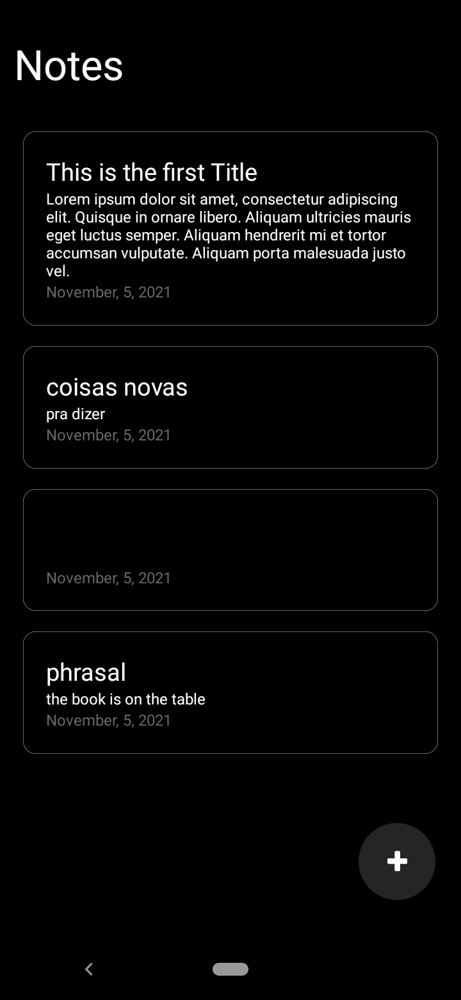

# notefoss

NoteFOSS is a note taking app for AMOLED and SuperAMOLED smartphones:
- [x] Primary Screens
- [x] Database with Firebase
- [ ] Login and Register Screens with real authentication
- [ ] Edit note

## About this project

With this project i want to practice React-Native and integrate it with the Firebase Database (Firestore). The absolute black (#000) was chosen because i didn't find any other note taking app that uses absolute black that is better for AMOLED and SuperAMOLED users.

## Find me here

Henrique Marques
* [allyson2308h@gmail.com](mailto:allyson2308h@gmail.com)
* [github.com/all123all](http://github.com/all123all)
* [http://linkedin.com/in/all123all/](http://linkedin.com/in/allyson-henrique-marques-1b48b8b4/)

## Screenshots

Thanks for coming here! 
